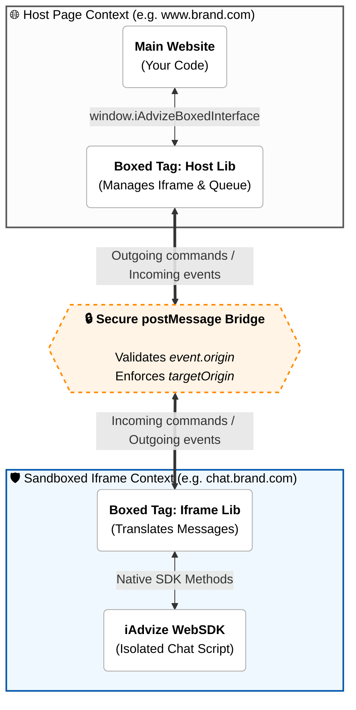

```mermaid
flowchart TB
    %% Styling
    classDef hostZone fill:#fcfcfc,stroke:#555,stroke-width:2px,color:#000
    classDef iframeZone fill:#f0f8ff,stroke:#0055aa,stroke-width:2px,color:#000
    classDef bridge fill:#fff4e6,stroke:#ff8c00,stroke-width:2px,stroke-dasharray: 5 5,color:#000
    classDef component fill:#ffffff,stroke:#aaa,stroke-width:1px,color:#000

    %% Host Zone
    subgraph Host ["<div style='width:420px'>🌐 Host Page Context (e.g. www.brand.com)</div>"]
        direction TB
        App("<b>Main Website</b><br/>(Your Code)"):::component
        HostLib("<b>Boxed Tag: Host Lib</b><br/>(Manages Iframe & Queue)"):::component

        App <-- "window.iAdvizeBoxedInterface" --> HostLib
    end

    %% The Bridge
    Bridge{{"<div style='width:250px'><b>🔒 Secure postMessage Bridge</b><br/><br/>Validates <i>event.origin</i><br/>Enforces <i>targetOrigin</i></div>"}}:::bridge

    %% Iframe Zone
    subgraph Iframe ["<div style='width:420px'>🛡️ Sandboxed Iframe Context (e.g. chat.brand.com)</div>"]
        direction TB
        IframeLib("<b>Boxed Tag: Iframe Lib</b><br/>(Translates Messages)"):::component
        SDK("<b>iAdvize WebSDK</b><br/>(Isolated Chat Script)"):::component

        IframeLib <-- "Native SDK Methods" --> SDK
    end

    %% Cross-boundary Connections
    HostLib <== "Outgoing commands / Incoming events" ==> Bridge
    Bridge <== "Incoming commands / Outgoing events" ==> IframeLib

    %% Apply Subgraph Styles
    class Host hostZone
    class Iframe iframeZone
```
